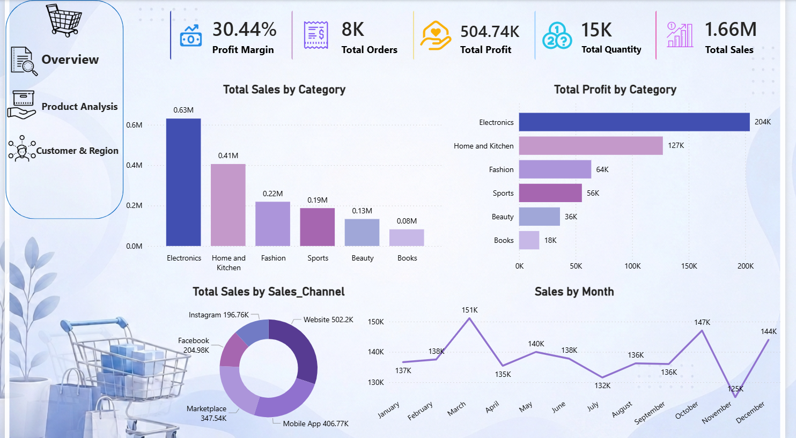

# E-Commerce Sales Analysis Dashboard

## 📊 Project Overview

An interactive **E-Commerce Sales Analysis Dashboard** built with **Microsoft Power BI** to analyze sales performance and transform raw e-commerce data into clear, actionable business insights.

The dashboard provides an interactive view of sales data through KPIs, visualizations, filters, and bookmarks, making it easier to explore performance and identify important patterns.

---

## 🎯 Project Objective

The main objective of this project is to:

* Analyze e-commerce sales performance.
* Track important business KPIs.
* Identify sales patterns and trends.
* Compare performance across different categories.
* Make the data easier to understand through interactive visualizations.
* Present business information in a clean and professional dashboard.

---

## 🛠️ Tools & Technologies

* **Power BI**
* **DAX**
* **Power Query**
* **Data Modeling**
* **Data Visualization**

---

## 📈 Dashboard Features

The dashboard includes:

* Interactive KPI cards.
* Sales performance analysis.
* Category-level analysis.
* Interactive filters and slicers.
* Bookmarks for easier navigation.
* Custom dashboard design.
* Interactive visualizations for exploring the data.

---

## 🧮 Data Analysis

The project demonstrates the complete analytics workflow:

**Data → Cleaning → Transformation → Modeling → DAX Measures → Visualization → Business Insights**

Power Query was used to prepare and transform the data, while DAX measures were created to support the analysis and KPIs.

---

## 💡 Business Insights

The dashboard allows users to explore the data and identify:

* Overall sales performance.
* Differences between product categories.
* Sales trends and patterns.
* Categories contributing to business performance.
* Areas that can be further investigated for business improvement.

---

## 🖥️ Dashboard Preview



---

## 📂 Project Structure

```text
E-Commerce-Sales-Analysis/
│
├── Dashboard/
│   └── E-Commerce-Sales-Analysis.pbix
│
├── Screenshots/
│   └── Capture.PNG
│
└── README.md
```

---

## ▶️ How to Use

1. Download the `.pbix` file from the **Dashboard** folder.
2. Open it using **Microsoft Power BI Desktop**.
3. Use the slicers, filters, and bookmarks to interact with the dashboard.
4. Explore the different visualizations and analyze the sales performance.

---

## 📚 Skills Demonstrated

* Data Cleaning
* Data Transformation
* Data Modeling
* DAX
* Power BI
* Dashboard Design
* Data Visualization
* Business Analysis
* Interactive Reporting

---

## 👩‍💻 Author

**Sara Basher**

Data Analysis & Business Analysis
